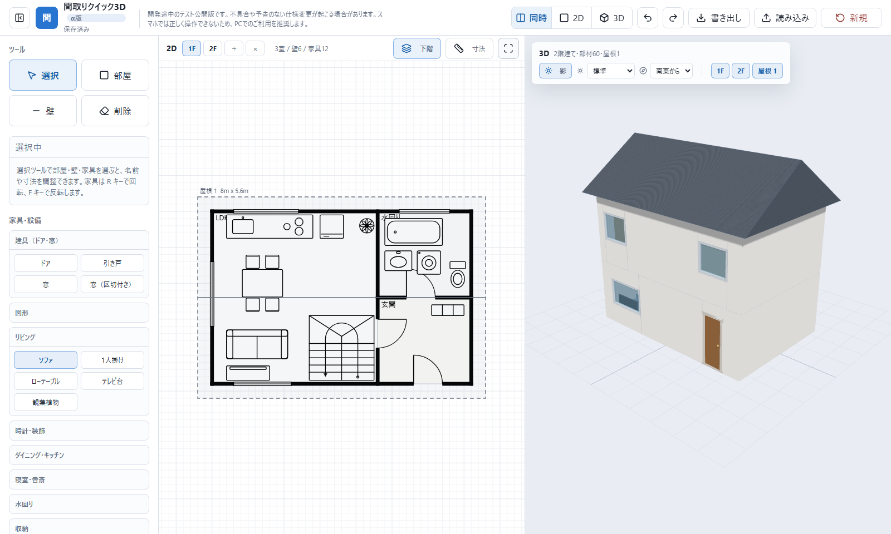

# 間取りクイック3D / Madori Quick 3D

[](https://github.com/tghcgu/madori/actions/workflows/deploy.yml)


ブラウザで2Dの間取りを描き、その場で3Dへ変換できる、インストール不要の間取り作成ツールです。

A browser-based floor plan editor that turns a 2D plan into an interactive 3D view, with no installation or account required.

**[日本語](#日本語) | [English](#english)**

## 公開サイト / Live App

| 種類 / Channel | URL |
| --- | --- |
| Cloudflare Pages 本番 / Production | **https://madori-5yu.pages.dev/** |
| GitHub Pages ミラー / Mirror | https://tghcgu.github.io/madori/ |
| `develop` プレビュー / Development preview | https://develop.madori-5yu.pages.dev/ |
| ソースコード / Repository | https://github.com/tghcgu/madori |

> [!IMPORTANT]
> 本ツールはPC向けのα版です。スマートフォンやタブレットでは表示できても、編集操作が正しく動かない場合があります。最新のChromeまたはEdgeを推奨します。



---

# 日本語

<details>
<summary><strong>目次</strong></summary>

- [このアプリについて](#このアプリについて)
- [すぐに使う](#すぐに使う)
- [主な機能](#主な機能)
- [画面構成](#画面構成)
- [基本操作](#基本操作)
- [保存、書き出し、読み込み](#保存書き出し読み込み)
- [データとプライバシー](#データとプライバシー)
- [ローカルで実行する](#ローカルで実行する)
- [技術構成](#技術構成)
- [ディレクトリ構成](#ディレクトリ構成)
- [データモデル](#データモデル)
- [ブランチとデプロイ](#ブランチとデプロイ)
- [トラブルシューティング](#トラブルシューティング)
- [現在の制限](#現在の制限)
- [フィードバックと開発参加](#フィードバックと開発参加)
- [利用条件、クレジット、免責](#利用条件クレジット免責)

</details>

## このアプリについて

間取りクイック3Dは、専門的なCADソフトを覚えなくても、部屋・壁・建具・家具を2Dキャンバスへ配置し、同じ内容を3Dで確認できるWebアプリです。

アカウント登録、インストール、バックエンドサーバーは不要です。作業中のデータはブラウザ内へ自動保存され、必要に応じてJSONファイルとして書き出せます。

### こんな用途に

- 小説、漫画、ゲーム、TRPGなどの舞台設計
- 引っ越し前の家具配置の検討
- リフォームや模様替えのラフ案
- 住宅・店舗・会場の簡易レイアウト
- 2Dと3Dを行き来しながらのアイデア整理
- WebGL、Three.js、Canvasを使った学習・試作

## すぐに使う

1. **[本番サイトを開きます](https://madori-5yu.pages.dev/)**。
2. 左側の「部屋」「壁」「ドア」「窓」「家具」などを選びます。
3. 2D画面をクリックまたはドラッグして配置します。
4. 「選択」で要素を選び、移動、サイズ変更、回転、色変更を行います。
5. 上部の「同時」「2D」「3D」で表示を切り替えます。
6. 大切なプランは「書き出し」からJSONファイルとして保存します。

インストールもログインも不要です。最初から用意されている間取りを編集するか、「雛形」からワンルーム、1LDK、2LDK、二階建て3LDK、作例を読み込めます。

## 主な機能

### 2D間取り編集

- 部屋をドラッグして作成
- 壁を直線・斜線で作成
- 開き戸、引き戸、通常窓、中央区切り付き窓を配置
- 円、円弧、多角形を壁として3D化
- 家具・設備を配置し、移動、サイズ変更、回転、左右反転
- 部屋名を本文とは別にドラッグして自由配置
- 幅・奥行・長さ・角度・座標を数値で編集
- 2D色と3D色を個別指定
- 寸法ラベルの表示・非表示
- 下階を半透明で表示するゴースト機能
- 選択した要素の配置固定
- マウスホイールによるズーム
- 右ドラッグによるキャンバス移動
- 全体表示への自動フィット
- Undo / Redo

壁とドア・窓が重なった場所では、ドアと窓の開口が優先されます。2D図面と3Dモデルの両方で、壁が建具部分をふさがないよう処理されます。

### 3Dプレビュー

- 2D間取りをThree.jsでリアルタイム変換
- `同時`、`2Dのみ`、`3Dのみ`の表示モード
- マウスドラッグによる視点回転・移動
- ホイールによるズーム
- 壁、床、ドア、引き戸、窓、家具、設備、階段、屋根を立体化
- 影のON/OFF
- 5段階の明るさ調整
- 8方位と真上から選べる光の向き
- 階ごとの表示・非表示
- 屋根全体の一時表示・非表示
- 3D上の物体をクリックして選択

### 複数階

- 最大4階まで追加
- 1F、2F、3F、4Fをタブで切り替え
- 下階の輪郭をゴースト表示
- 3Dでは階ごとに表示・非表示を切り替え
- 階高、床スラブ、最上階の壁上端を考慮して積層

### 複数屋根

- 切妻、寄棟、陸屋根を何枚でも追加
- 屋根ごとに幅、奥行、位置を編集
- 2D上でドラッグ移動
- 四隅のハンドルでサイズ変更
- 幅と奥行を90度入れ替え
- 2Dまたは3Dから屋根を選択
- 屋根ごとの固定、選択、削除
- 旧形式の1枚屋根データを自動移行

部屋を選択してから屋根を追加すると、その部屋を覆う大きさで配置されます。部屋を選択していない状態で2枚目以降を追加すると、重なって見失わないよう右隣へ配置されます。

### 家具・設備

| 分類 | 収録要素 |
| --- | --- |
| 建具 | 開き戸、引き戸、窓、中央区切り付き窓 |
| 図形 | 円、円弧、多角形 |
| リビング | ソファ、1人掛け、ローテーブル、テレビ台、観葉植物 |
| 時計・装飾 | 壁掛け時計、ホールクロック、水槽 |
| ダイニング・キッチン | ダイニングセット、椅子、キッチン、冷蔵庫 |
| 寝室・書斎 | シングルベッド、ダブルベッド、机、本棚 |
| 水回り | 浴槽、トイレ、洗面台、洗濯機 |
| 収納 | クローゼット、タンス |
| 階段 | 直階段、折り返し階段、らせん階段 |
| 屋外 | 車 |

各家具は2D用の平面記号と3Dモデルを持ちます。幅・奥行を変更しても、できるだけ形状の特徴を保つように生成されます。

### 雛形

| 雛形 | 内容 |
| --- | --- |
| ワンルーム | 生活空間と水回りをまとめた小規模プラン |
| 1LDK | LDK、寝室、玄関、水回りを含む基本プラン |
| 2LDK | LDK、2部屋、水回り、家具を含むプラン |
| 二階建て 3LDK | 1Fと2F、階段、複数室、屋根を含むプラン |
| サンプル（作例） | 各種図形、家具、設備を確認するための作例 |

> [!WARNING]
> 雛形を適用すると現在の間取りを置き換えます。確認ダイアログの内容を確認し、必要なプランは先に書き出してください。

## 画面構成

| エリア | 役割 |
| --- | --- |
| 上部バー | 表示切替、Undo / Redo、JSON書き出し・読み込み、新規作成 |
| 左パネル | 作図ツール、選択中のプロパティ、家具、屋根、雛形 |
| 2Dペイン | 間取りの作成、選択、移動、リサイズ、寸法確認 |
| 3Dペイン | 自動生成モデルの確認、視点操作、光・影・階表示の調整 |

左上のパネル切替ボタンで、編集パネルを一時的に隠せます。作業内容に応じて、上部の表示切替から2Dまたは3Dを広く表示できます。

## 基本操作

### マウス操作

| 場所 | 操作 | 内容 |
| --- | --- | --- |
| 2D | 左ドラッグ | 要素の作成、選択中の要素の移動・サイズ変更 |
| 2D | 右ドラッグ | 表示位置の移動 |
| 2D | ホイール | 拡大・縮小 |
| 2D | ダブルクリック | 要素を選択してプロパティを表示 |
| 2D | 四隅・端点をドラッグ | 部屋、家具、屋根、線要素のサイズ変更 |
| 3D | 左ドラッグ | 視点を回転 |
| 3D | 右ドラッグ | 視点を平行移動 |
| 3D | ホイール | 拡大・縮小 |
| 3D | クリック | 物体を選択 |

### キーボードショートカット

| キー | 内容 |
| --- | --- |
| `R` | 選択中の要素を90度回転。屋根では幅と奥行を入れ替え |
| `Shift + R` | 家具や線要素を15度単位で細かく回転 |
| `F` | 家具の左右反転、ドアの開き・引き戸の重なりを反転 |
| `L` | 選択中の要素を固定・固定解除 |
| `Delete` / `Backspace` | 選択中の要素を削除 |
| `Ctrl + Z` / `Cmd + Z` | 元に戻す |
| `Ctrl + Y` / `Cmd + Shift + Z` | やり直す |

入力欄や選択欄を編集中は、文字入力を妨げないよう一部のショートカットが無効になります。

## 保存、書き出し、読み込み

### 自動保存

間取りはブラウザの`localStorage`へ自動保存されます。ログインやクラウド保存はありません。

- 保存キー: `madori-quick-3d-plan`
- 表示モード、寸法表示、影、光、下階表示もブラウザへ保存
- 通常は再読み込みやブラウザ再起動後も復元
- サイトデータ、Cookie、ストレージを削除すると消去
- 別ブラウザ、別PC、別ドメインには自動同期されない

### JSON書き出し

上部の「書き出し」で、プラン全体を`madori-YYYY-MM-DD.json`として保存します。階、部屋、壁、建具、家具、図形、複数屋根、色、位置、固定状態が含まれます。

### JSON読み込み

上部の「読み込み」で、以前に書き出したJSONを復元できます。旧バージョンの単一階データや1枚屋根データも、可能な範囲で現在の形式へ変換します。

> [!TIP]
> 重要なプランは、ブラウザの自動保存だけに頼らず、定期的にJSONを書き出してください。

## データとプライバシー

- 間取りデータは利用中のブラウザ内に保存
- 間取りデータをアプリのサーバーへ送信しない
- アカウント、データベース、クラウド同期なし
- 広告なし
- 訪問数の把握にはCloudflare Web Analyticsを使用
- Cloudflare Web AnalyticsはCookieを使用せず、個人を追跡しない構成

JSONファイルを「読み込み」した場合も、処理はブラウザ内で行われます。

## ローカルで実行する

### 必要なもの

- Git
- Node.js 20以上
- Node.js 22推奨。GitHub ActionsでもNode.js 22を使用
- WebGL対応のPC向けブラウザ

### セットアップ

```bash
git clone https://github.com/tghcgu/madori.git
cd madori
npm install
npm run dev
```

起動後に次のURLを開きます。

```text
http://127.0.0.1:5173/
```

Windows PowerShellで`npm.ps1`の実行がブロックされる場合は、`.cmd`版を使用してください。

```powershell
npm.cmd install
npm.cmd run dev
```

### npmスクリプト

| コマンド | 内容 |
| --- | --- |
| `npm run dev` | Vite開発サーバーを`127.0.0.1`で起動 |
| `npm run build` | TypeScriptの型チェック後、`dist/`へ本番ビルド |
| `npm run preview` | `dist/`の本番ビルドをローカルで確認 |
| `npm ci` | `package-lock.json`に基づいて依存関係を再現 |

本番ビルド:

```bash
npm run build
npm run preview
```

Windows:

```powershell
npm.cmd run build
npm.cmd run preview
```

## 技術構成

| 技術 | 用途 |
| --- | --- |
| TypeScript | 状態管理、編集処理、データモデル、UI制御 |
| Vite | 開発サーバー、本番ビルド、静的配信向けバンドル |
| HTML / CSS | アプリシェル、レスポンシブ表示、操作パネル |
| Canvas 2D | 間取り、家具記号、寸法、選択ハンドルの描画 |
| Three.js | 3Dモデル、カメラ、ライト、影、WebGL描画 |
| OrbitControls | 3Dカメラの回転、移動、ズーム |
| Lucide Icons | ツールバーと操作ボタンのアイコン |
| localStorage | プランと表示設定のローカル自動保存 |
| Cloudflare Pages | 本番・プレビュー配信 |
| GitHub Actions / Pages | `main`の自動ビルドとミラー配信 |

サーバーAPIやデータベースを持たない、静的なシングルページアプリケーションです。

## ディレクトリ構成

```text
madori/
├─ .github/
│  └─ workflows/
│     └─ deploy.yml          # GitHub Pagesへの自動デプロイ
├─ docs/
│  └─ images/                # README用画像
├─ public/
│  └─ google*.html           # Search Console確認ファイル
├─ src/
│  ├─ main.ts                # 2D編集、状態、3D生成、保存処理
│  └─ styles.css             # アプリ全体のスタイル
├─ index.html                # UI構造とアプリのエントリ
├─ package.json              # 依存関係とnpmスクリプト
├─ package-lock.json         # 依存関係の固定
├─ tsconfig.json             # TypeScript設定
└─ vite.config.ts            # 配信先ごとのbase設定
```

## データモデル

書き出しJSONの最上位は、おおむね次の構造です。

```json
{
  "floors": [
    {
      "id": "floor-...",
      "name": "1F",
      "entities": [
        {
          "id": "room-...",
          "type": "room",
          "name": "LDK",
          "x": 0,
          "y": 0,
          "w": 600,
          "h": 400,
          "color": "#ffffff"
        }
      ]
    }
  ],
  "activeFloor": 0,
  "selectedId": null,
  "roofs": [
    {
      "id": "roof-...",
      "type": "roof",
      "kind": "gable",
      "x": -40,
      "y": -40,
      "w": 680,
      "h": 480
    }
  ]
}
```

座標と寸法の単位はセンチメートルです。主な`entity.type`は`room`、`wall`、`door`、`window`、`furniture`、`shape`です。屋根は全階共通の`roofs`配列で管理され、最上階の上へ3D表示されます。

## ブランチとデプロイ

| ブランチ | 用途 | 公開先 |
| --- | --- | --- |
| `main` | 本番 | Cloudflare Pages本番、GitHub Pages |
| `develop` | 次期版の確認 | Cloudflare Pagesブランチプレビュー |

### Cloudflare Pages

| 項目 | 設定 |
| --- | --- |
| Production branch | `main` |
| Framework preset | Vite、またはNone |
| Build command | `npm run build` |
| Build output directory | `dist` |
| Root directory | 空欄 |

`main`へのpushで本番が更新され、`develop`へのpushでプレビューが生成されます。

### GitHub Pages

`.github/workflows/deploy.yml`が`main`へのpushを検知し、Node.js 22で`npm ci`と`npm run build`を実行して`dist/`を公開します。

GitHub Pagesでは`/madori/`配下、Cloudflare Pagesとローカルでは`/`配下になるため、`vite.config.ts`が`DEPLOY_TARGET=github`を見て`base`を切り替えます。

## トラブルシューティング

### `npm`を実行できない

Windows PowerShellの実行ポリシーで`npm.ps1`が止められる場合があります。

```powershell
npm.cmd install
npm.cmd run dev
```

### `ERR_CONNECTION_REFUSED`が表示される

開発サーバーが起動していません。プロジェクトフォルダーで`npm.cmd run dev`を実行し、ターミナルを閉じずに`http://127.0.0.1:5173/`を開いてください。

### 3Dが真っ白、または表示されない

- ブラウザを最新版へ更新
- ChromeまたはEdgeでハードウェアアクセラレーションを有効化
- WebGLが無効化されていないか確認
- ブラウザ拡張機能を一時的に無効化
- ページを再読み込み

### 保存した間取りが消えた

サイトデータの削除、シークレットモードの終了、別ドメインへの移動で`localStorage`が変わると復元できません。書き出したJSONがある場合は「読み込み」から復元してください。

### Cloudflare版とGitHub Pages版でデータが違う

ブラウザストレージはドメインごとに分離されています。`madori-5yu.pages.dev`と`tghcgu.github.io`のデータは自動共有されません。JSON書き出し・読み込みで移動してください。

### 変更が公開サイトに反映されない

- 対象ブランチが`main`または`develop`か確認
- GitHub ActionsまたはCloudflare Pagesのビルド状態を確認
- デプロイ完了後に強制再読み込み
- `dist/`ではなくソースを直接アップロードしていないか確認

## 現在の制限

- α版のため、データ形式やUIが予告なく変わる可能性があります。
- PC操作を前提としており、スマートフォン・タブレット編集は非推奨です。
- 建築CAD、構造計算、法規確認、施工図作成の代替ではありません。
- 寸法、壁厚、建具、家具、屋根の表現は簡易モデルです。
- クラウド保存、ログイン、共同編集、URL共有はありません。
- ブラウザやGPUによって3Dの描画品質・速度が異なります。
- 非常に大きいプランや部材数の多いプランでは処理が重くなる場合があります。
- 自動保存データはドメインとブラウザプロファイルごとに分かれます。

## フィードバックと開発参加

不具合、改善案、追加してほしい家具や設備は、次の方法でお知らせください。

- メール: **knihud@gmail.com**
- GitHub Issues: https://github.com/tghcgu/madori/issues
- Pull Request: https://github.com/tghcgu/madori/pulls

不具合報告には、利用URL、ブラウザ名、再現手順、期待した動作、実際の動作、可能であればスクリーンショットや書き出しJSONを含めてください。個人情報を含むJSONは公開Issueへ添付しないでください。

## 利用条件、クレジット、免責

- 創作、検討、個人利用、商用利用を問わず利用できます。
- 作成した間取りや画像を公開・配布する場合は、`間取りクイック3D`の名称をクレジット表記してください。
- 可能であれば本番URL `https://madori-5yu.pages.dev/`も併記してください。
- 嫌がらせ、差別、個人情報の無断公開、スパム、権利侵害、不正アクセス、犯罪の助長、運営妨害などには利用できません。
- 詳細な禁止事項はアプリ内の「このアプリについて」を確認してください。
- 本ツールと作成物は無保証です。
- 寸法や表現の建築的な正確性は保証されません。
- 実際の設計、法規確認、施工には有資格者・専門家へ相談してください。
- 本リポジトリには現在、独立したオープンソースライセンスファイルはありません。ソースコードの再利用・再配布については作者へお問い合わせください。

---

# English

<details>
<summary><strong>Table of Contents</strong></summary>

- [About](#about)
- [Quick Start](#quick-start)
- [Feature Overview](#feature-overview)
- [Interface](#interface)
- [Controls](#controls)
- [Persistence and File Transfer](#persistence-and-file-transfer)
- [Privacy](#privacy)
- [Run Locally](#run-locally)
- [Technology](#technology)
- [Project Structure](#project-structure)
- [Data Model](#data-model)
- [Branches and Deployment](#branches-and-deployment)
- [Troubleshooting](#troubleshooting)
- [Current Limitations](#current-limitations)
- [Feedback and Contributions](#feedback-and-contributions)
- [Usage, Credit, and Disclaimer](#usage-credit-and-disclaimer)

</details>

## About

Madori Quick 3D is a browser-based floor plan editor for quickly placing rooms, walls, openings, furniture, and equipment on a 2D canvas and reviewing the same plan as an interactive 3D model.

It requires no account, installation, backend server, or database. Work is saved automatically in the browser and can be exported as a JSON file for backup or transfer.

### Good for

- Planning locations for novels, comics, games, and tabletop RPGs
- Trying furniture layouts before moving or redecorating
- Sketching renovation and room arrangement ideas
- Creating rough home, shop, office, or venue layouts
- Exploring ideas while switching between 2D and 3D
- Learning or prototyping with Canvas, WebGL, and Three.js

## Quick Start

1. **[Open the production app](https://madori-5yu.pages.dev/)**.
2. Choose a room, wall, door, window, shape, or furniture tool from the left panel.
3. Click or drag on the 2D canvas to place it.
4. Use the Select tool to move, resize, rotate, recolor, or lock an item.
5. Switch between Split, 2D, and 3D views from the top bar.
6. Export important plans as JSON using the Download button.

You can edit the starter plan immediately or load a studio, 1LDK, 2LDK, two-story 3LDK, or showcase template.

## Feature Overview

### 2D editing

- Draw rooms by dragging
- Draw horizontal, vertical, and angled walls
- Add swing doors, sliding doors, windows, and divided windows
- Turn circles, arcs, and polygons into wall geometry
- Place, move, resize, rotate, and flip furniture
- Drag room labels independently from room geometry
- Edit dimensions, line length, angle, coordinates, and colors numerically
- Set separate 2D and 3D colors
- Toggle dimension labels
- Show the floor below as a translucent guide
- Lock selected items to prevent accidental movement or deletion
- Zoom with the mouse wheel and pan with right-drag
- Fit the complete plan to the viewport
- Undo and redo editing operations

When a wall overlaps a door or window, the opening takes priority. The wall is split around the opening in both the 2D drawing and generated 3D model.

### 3D preview

- Real-time conversion from the 2D plan using Three.js
- Split, 2D-only, and 3D-only view modes
- Orbit, pan, and zoom camera controls
- 3D walls, floors, doors, sliding doors, windows, furniture, equipment, stairs, and roofs
- Optional shadows
- Five light intensity levels
- Eight compass directions plus overhead lighting
- Per-floor visibility controls
- Temporary roof visibility toggle
- Click 3D objects to select and edit them

### Multiple floors

- Up to four floors
- Separate 1F, 2F, 3F, and 4F tabs
- Translucent lower-floor reference in 2D
- Per-floor visibility in 3D
- Stacked floor heights, slabs, and top-floor wall caps

### Multiple editable roofs

- Add any number of gable, hip, and flat roofs
- Edit width, depth, and position for each roof
- Drag roofs on the 2D canvas
- Resize roofs from corner handles
- Swap width and depth with a 90-degree rotation
- Select roofs from either the 2D or 3D view
- Lock, select, and delete roofs independently
- Automatically migrate legacy single-roof plans

If a room is selected before adding a roof, the new roof is sized around that room. Additional roofs created without a selected room are placed beside the previous roof so they do not disappear underneath it.

### Included objects

| Category | Objects |
| --- | --- |
| Openings | Swing door, sliding door, window, divided window |
| Shapes | Circle, arc, polygon |
| Living | Sofa, armchair, low table, TV stand, plant |
| Clocks and decor | Wall clock, grandfather clock, aquarium |
| Dining and kitchen | Dining set, chair, kitchen unit, refrigerator |
| Bedroom and study | Single bed, double bed, desk, shelf |
| Bathroom and utility | Bathtub, toilet, washbasin, washing machine |
| Storage | Closet, wardrobe |
| Stairs | Straight stairs, U-shaped stairs, spiral stairs |
| Exterior | Car |

Each item has a dedicated 2D plan symbol and a generated 3D representation. The geometry adapts to user-defined width and depth where practical.

### Templates

| Template | Contents |
| --- | --- |
| Studio | Compact living area with bathroom facilities |
| 1LDK | Living/dining/kitchen, bedroom, entrance, and bathroom area |
| 2LDK | LDK, two rooms, bathroom area, and furniture |
| Two-story 3LDK | Two floors, stairs, multiple rooms, furniture, and roof |
| Showcase | A broad sample of shapes, furniture, and equipment |

> [!WARNING]
> Applying a template replaces the current plan after confirmation. Export anything important before replacing it.

## Interface

| Area | Purpose |
| --- | --- |
| Top bar | View mode, undo/redo, JSON export/import, and new plan |
| Left panel | Drawing tools, selected-item properties, furniture, roofs, and templates |
| 2D pane | Drawing, selection, movement, resizing, and dimensions |
| 3D pane | Generated model, camera controls, lighting, shadows, and floor visibility |

The left editor panel can be collapsed. Split, 2D-only, and 3D-only modes let you dedicate more space to the current task.

## Controls

### Mouse

| Location | Input | Action |
| --- | --- | --- |
| 2D | Left-drag | Draw, move, or resize an item |
| 2D | Right-drag | Pan the canvas |
| 2D | Mouse wheel | Zoom |
| 2D | Double-click | Select an item and show its properties |
| 2D | Drag handles | Resize rooms, furniture, roofs, and line endpoints |
| 3D | Left-drag | Orbit the camera |
| 3D | Right-drag | Pan the camera |
| 3D | Mouse wheel | Zoom |
| 3D | Click | Select a 3D object |

### Keyboard

| Key | Action |
| --- | --- |
| `R` | Rotate the selected item by 90 degrees; swaps roof width and depth |
| `Shift + R` | Fine 15-degree rotation for furniture and line elements |
| `F` | Flip furniture or reverse a door/sliding-door side |
| `L` | Lock or unlock the selected item |
| `Delete` / `Backspace` | Delete the selected item |
| `Ctrl + Z` / `Cmd + Z` | Undo |
| `Ctrl + Y` / `Cmd + Shift + Z` | Redo |

Some shortcuts are disabled while an input, select box, or editable field has focus.

## Persistence and File Transfer

### Automatic browser storage

Plans are saved automatically to browser `localStorage`. There is no login or cloud save.

- Main storage key: `madori-quick-3d-plan`
- View mode, dimensions, shadows, lighting, and lower-floor display are also saved
- Data normally survives reloads and browser restarts
- Clearing site storage deletes the saved plan
- Data does not synchronize between browsers, computers, or domains

### JSON export and import

Export creates a file named `madori-YYYY-MM-DD.json`. It contains floors, rooms, walls, openings, furniture, shapes, roofs, colors, positions, and lock states.

Import restores a previously exported file. The loader also migrates older single-floor and single-roof formats where possible.

> [!TIP]
> Export important work regularly instead of relying only on browser storage.

## Privacy

- Floor-plan data stays in the current browser
- Plans are not uploaded to an application server
- No account, application database, or cloud synchronization
- No advertising
- Cookie-free Cloudflare Web Analytics is used for aggregate visit counts

Imported JSON files are processed entirely in the browser.

## Run Locally

### Requirements

- Git
- Node.js 20 or newer
- Node.js 22 recommended and used in GitHub Actions
- A desktop browser with WebGL support

### Setup

```bash
git clone https://github.com/tghcgu/madori.git
cd madori
npm install
npm run dev
```

Open:

```text
http://127.0.0.1:5173/
```

If PowerShell blocks `npm.ps1`, use the Windows command wrappers:

```powershell
npm.cmd install
npm.cmd run dev
```

### Scripts

| Command | Purpose |
| --- | --- |
| `npm run dev` | Start the Vite development server on `127.0.0.1` |
| `npm run build` | Type-check with TypeScript and build production files into `dist/` |
| `npm run preview` | Preview the production build locally |
| `npm ci` | Install the exact dependency tree from `package-lock.json` |

Production build:

```bash
npm run build
npm run preview
```

Windows:

```powershell
npm.cmd run build
npm.cmd run preview
```

## Technology

| Technology | Role |
| --- | --- |
| TypeScript | State, editing logic, data model, and UI behavior |
| Vite | Development server and production bundling |
| HTML / CSS | Application shell, panels, and responsive layout |
| Canvas 2D | Floor plan, symbols, dimensions, and selection handles |
| Three.js | 3D geometry, camera, lighting, shadows, and WebGL rendering |
| OrbitControls | 3D orbit, pan, and zoom interaction |
| Lucide Icons | Toolbar and command icons |
| localStorage | Local automatic plan and preference storage |
| Cloudflare Pages | Production and preview hosting |
| GitHub Actions / Pages | Automated `main` build and mirror hosting |

This is a static single-page application with no server API or database.

## Project Structure

```text
madori/
├─ .github/
│  └─ workflows/
│     └─ deploy.yml          # GitHub Pages deployment
├─ docs/
│  └─ images/                # README images
├─ public/
│  └─ google*.html           # Search Console verification
├─ src/
│  ├─ main.ts                # 2D editor, state, 3D generation, persistence
│  └─ styles.css             # Application styling
├─ index.html                # UI structure and application entry
├─ package.json              # Dependencies and npm scripts
├─ package-lock.json         # Locked dependency tree
├─ tsconfig.json             # TypeScript configuration
└─ vite.config.ts            # Deployment-specific base path
```

## Data Model

The exported JSON has the following high-level shape:

```json
{
  "floors": [
    {
      "id": "floor-...",
      "name": "1F",
      "entities": [
        {
          "id": "room-...",
          "type": "room",
          "name": "Living Room",
          "x": 0,
          "y": 0,
          "w": 600,
          "h": 400,
          "color": "#ffffff"
        }
      ]
    }
  ],
  "activeFloor": 0,
  "selectedId": null,
  "roofs": [
    {
      "id": "roof-...",
      "type": "roof",
      "kind": "gable",
      "x": -40,
      "y": -40,
      "w": 680,
      "h": 480
    }
  ]
}
```

Coordinates and dimensions use centimeters. Common entity types are `room`, `wall`, `door`, `window`, `furniture`, and `shape`. Roofs are stored separately in the plan-level `roofs` array and rendered above the highest floor.

## Branches and Deployment

| Branch | Purpose | Deployment |
| --- | --- | --- |
| `main` | Production | Cloudflare Pages production and GitHub Pages |
| `develop` | Upcoming changes | Cloudflare Pages branch preview |

### Cloudflare Pages settings

| Setting | Value |
| --- | --- |
| Production branch | `main` |
| Framework preset | Vite or None |
| Build command | `npm run build` |
| Build output directory | `dist` |
| Root directory | Empty |

Pushing to `main` updates production. Pushing to `develop` creates or updates the branch preview.

### GitHub Pages

`.github/workflows/deploy.yml` runs on every push to `main`, installs dependencies with Node.js 22, builds the app, and publishes `dist/`.

GitHub Pages serves the app under `/madori/`, while Cloudflare Pages and local development use `/`. `vite.config.ts` switches the Vite `base` when `DEPLOY_TARGET=github` is present.

## Troubleshooting

### PowerShell refuses to run `npm`

Use the `.cmd` wrappers:

```powershell
npm.cmd install
npm.cmd run dev
```

### The browser shows `ERR_CONNECTION_REFUSED`

The development server is not running. Run `npm.cmd run dev` in the repository directory, keep the terminal open, and then visit `http://127.0.0.1:5173/`.

### The 3D view is blank

- Update the browser
- Try a current version of Chrome or Edge
- Enable hardware acceleration
- Confirm that WebGL is enabled
- Temporarily disable browser extensions
- Reload the page

### A saved plan disappeared

Clearing site data, closing a private browsing session, or changing domains removes access to that domain's `localStorage`. Restore from an exported JSON file if available.

### Cloudflare and GitHub Pages show different saved plans

Browser storage is isolated by domain. Data on `madori-5yu.pages.dev` does not automatically appear on `tghcgu.github.io`. Export the plan from one site and import it into the other.

### A deployment does not show the latest change

- Confirm the change was pushed to `main` or `develop`
- Check GitHub Actions or Cloudflare Pages build status
- Wait for the deployment to finish and hard-refresh the page
- Confirm the build output directory is `dist`

## Current Limitations

- This is alpha software, so the UI and file format may change without notice.
- Editing is designed for desktop PCs. Phones and tablets are not recommended.
- It is not a replacement for architectural CAD, structural analysis, code review, or construction drawings.
- Dimensions, wall thicknesses, openings, furniture, and roofs are simplified representations.
- There is no account, cloud save, collaboration, or share-by-URL feature.
- 3D performance and appearance vary by browser and GPU.
- Very large plans or plans with many objects may become slower.
- Automatic saves are isolated by domain and browser profile.

## Feedback and Contributions

- Email: **knihud@gmail.com**
- GitHub Issues: https://github.com/tghcgu/madori/issues
- Pull Requests: https://github.com/tghcgu/madori/pulls

For bug reports, include the site URL, browser, reproduction steps, expected behavior, actual behavior, and screenshots or an exported JSON file when appropriate. Do not attach a JSON file containing private information to a public issue.

## Usage, Credit, and Disclaimer

- The app may be used for creative work, planning, personal projects, and commercial work.
- When publishing or distributing generated plans or images, credit `Madori Quick 3D` / `間取りクイック3D`.
- Include `https://madori-5yu.pages.dev/` with the credit when possible.
- Do not use the app for harassment, discrimination, doxxing, spam, rights violations, unauthorized access, criminal facilitation, or service disruption.
- See the in-app About section for the fuller prohibited-use list.
- The application and generated output are provided without warranty.
- Architectural and dimensional accuracy is not guaranteed.
- Consult qualified professionals for real design, regulatory review, and construction.
- This repository currently has no standalone open-source license file. Contact the author before reusing or redistributing the source code.

---

**間取りクイック3D / Madori Quick 3D**

- Production: https://madori-5yu.pages.dev/
- Repository: https://github.com/tghcgu/madori
- Contact: knihud@gmail.com
