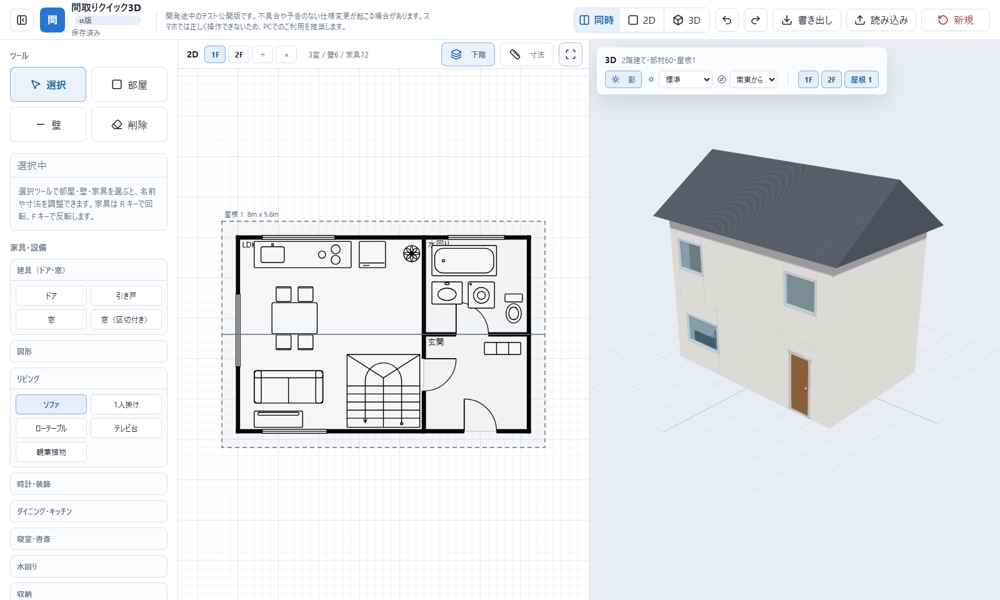

# 間取りクイック3D / Madori Quick 3D

[](https://github.com/tghcgu/madori/actions/workflows/deploy.yml)


ブラウザで2Dの間取りを描き、その場で3Dへ変換できる、インストール不要の間取り作成ツールです。

A browser-based floor plan editor that turns a 2D plan into an interactive 3D view, with no installation or account required.

**[日本語](#日本語) | [English](#english)**

## 公開サイト / Live App

| 種類 / Channel | URL |
| --- | --- |
| Cloudflare Pages 本番 / Production | **https://madori-5yu.pages.dev/** |
| 間取り専用版（3Dなし） / Plan-only edition | https://madori-5yu.pages.dev/plan/ |
| GitHub Pages ミラー / Mirror | https://tghcgu.github.io/madori/ （間取り専用版 / plan-only: https://tghcgu.github.io/madori/plan/ ） |
| `develop` プレビュー / Development preview | https://develop.madori-5yu.pages.dev/ |
| ソースコード / Repository | https://github.com/tghcgu/madori |

> [!IMPORTANT]
> 本ツールはPC向けのα版です。スマートフォンやタブレットでは表示できても、編集操作が正しく動かない場合があります。最新のChromeまたはEdgeを推奨します。



---

# 日本語

<details>
<summary><strong>目次</strong></summary>

- [このアプリについて](#このアプリについて)
- [すぐに使う](#すぐに使う)
- [主な機能](#主な機能)
- [画面構成](#画面構成)
- [基本操作](#基本操作)
- [保存、書き出し、読み込み](#保存書き出し読み込み)
- [データとプライバシー](#データとプライバシー)
- [ローカルで実行する](#ローカルで実行する)
- [技術構成](#技術構成)
- [ディレクトリ構成](#ディレクトリ構成)
- [データモデル](#データモデル)
- [ブランチとデプロイ](#ブランチとデプロイ)
- [トラブルシューティング](#トラブルシューティング)
- [現在の制限](#現在の制限)
- [フィードバックと開発参加](#フィードバックと開発参加)
- [利用条件、クレジット、免責](#利用条件クレジット免責)

</details>

## このアプリについて

間取りクイック3Dは、専門的なCADソフトを覚えなくても、部屋・壁・建具・家具を2Dキャンバスへ配置し、同じ内容を3Dで確認できるWebアプリです。

アカウント登録、インストール、バックエンドサーバーは不要です。作業中のデータはブラウザ内へ自動保存され、必要に応じてJSONファイルとして書き出せます。

### こんな用途に

- 小説、漫画、ゲーム、TRPGなどの舞台設計
- 引っ越し前の家具配置の検討
- リフォームや模様替えのラフ案
- 住宅・店舗・会場の簡易レイアウト
- 2Dと3Dを行き来しながらのアイデア整理
- WebGL、Three.js、Canvasを使った学習・試作

## すぐに使う

1. **[本番サイトを開きます](https://madori-5yu.pages.dev/)**。
2. 左側の「部屋」「壁」「ドア」「窓」「家具」などを選びます。
3. 2D画面をクリックまたはドラッグして配置します。
4. 「選択」で要素を選び、移動、サイズ変更、回転、色変更を行います。
5. 上部の「同時」「2D」「3D」で表示を切り替えます。
6. 大切なプランは「書き出し」からJSONファイルとして保存します。

インストールもログインも不要です。最初から用意されている間取りを編集するか、「雛形」からワンルーム、1LDK、2LDK、二階建て3LDK、作例を読み込めます。

## 主な機能

### 2D間取り編集

- 部屋をドラッグして作成。作った部屋・床には最初は名前を付けず、2Dに文字を出しません（必要なときだけ「選択中」で名前を付けられます）
- 壁を直線・斜線で作成
- 開き戸、引き戸、通常窓、中央区切り付き窓を配置
- 円、円弧、多角形を壁として3D化
- 家具・設備を配置し、移動、サイズ変更、回転、左右反転
- 家具のデザインを「選択中」の見本から選択（椅子・ソファ・ベッド・テーブル・冷蔵庫・洗濯機・トイレ・植物・ラグ・岩・外灯・花壇・フェンス・スツール・番号の印・足跡・倒れた人・血など43種類。観葉植物の「らせんの葉」は、ひとつ前の標準の3Dの形を残したもの）。2Dの記号と3Dの形が同じデザインに変わります（例: 丸い座面の椅子は3Dでも丸い座面と曲げ木の背もたれ、布団を折り返したベッドは3Dでも掛け布団の角が折れ、ガラス天板のテーブルは3Dでもガラス越しに下の棚が見える）。`V`キーで順に切り替え、同じ種類を続けて置くと最後に選んだデザインを使います。「2Dの記号のみ」と書かれたデザイン（クローゼットの斜線など）は、3Dは標準の形のままです
- 3Dを真上から見た形は、2Dの記号と同じになるように作っています。岩の輪郭と稜線、池の輪郭と石の位置、飛び石・花壇の花の並び、木目、ラグの柄、植物の葉の向きなどは、2Dと3Dが同じデータから作られます（冷蔵庫の雪の結晶や靴箱の靴のように、見分けるための図柄は2Dだけに描きます）
- 部屋名を本文とは別にドラッグして自由配置
- 「ペン」ツールで、好きな色で床に描けます（血だまりや汚れ、印などに）。2Dの上をドラッグすると線、クリックで点、「囲んで塗る」にすると囲んだ所を塗りつぶします。よく使う色（血の色・赤・黒・白など）から選ぶか、カラーコード（透明度も可）で決め、太さは1〜300cm。描いた線は3Dでも床に同じ形で描かれ、選ぶと色・太さ・描き方をあとから変えられます（線の上をクリックすると選べます）。ペンの色や太さはブラウザに記憶されます
- 「テキスト」ツールで間取りの好きな場所に文字を配置。内容（改行可）・大きさ・回転・色を編集でき、ドラッグ移動・固定・Undo / Redo・保存に対応。空にすると削除。2Dだけに表示され、3Dには出ません
- 幅・奥行・長さ・角度・座標を数値で編集
- 2D色と3D色を個別指定。見本から選ぶほか、カラーコード（`#RRGGBB`）を直接入力できます。末尾に2桁足した`#RRGGBBAA`では透明度も決められ（`00`で透明〜`ff`で不透明。例: `#2775d180`で半分透ける）、2Dでは同じ色の要素をまとめて1回で透かすので重なった所や壁の角も同じ濃さ、3Dでは床・壁・建具・家具がまるごと透けます（透けている物は影を落としません）。見本では透明度が市松模様で分かり、見本で色を選び直しても透明度はそのまま。カラーコードを空にすると標準の色に戻ります
- 寸法ラベル（部屋・屋根の幅×奥行）の表示・非表示。初期状態は非表示
- ほかの階を半透明で重ねる「透過」表示。横の▼から、透かす階（すぐ下・すぐ上・ほかの階すべて・階を名前で指定）、透かす色（カラーコード。空欄なら元の色）、濃さを選べます。透かした階は一度ふつうに描いてから1回だけ半透明で重ねるので、壁の角や重なった所も同じ濃さです
- 2D上の屋根の一時表示・非表示
- パーツ検索（ひらがな・カタカナ・別名でも検索可。例: いす、まど、れいぞうこ）
- 選択した要素の配置固定
- マウスホイールによるズーム（0.0001倍〜1万倍まで、ほぼ無限に拡大・縮小。遠くまで引くと方眼の間隔も自動で広がり、大きく拡大したときは部屋の中にも方眼を薄く表示して、右ドラッグで動かしていることが分かるようにします）
- 右ドラッグによるキャンバス移動
- 全体表示への自動フィット
- Undo / Redo

壁とドア・窓が重なった場所では、ドアと窓の開口が優先されます。2D図面と3Dモデルの両方で、壁が建具部分をふさがないよう処理されます。

### 3Dプレビュー

- 2D間取りをThree.jsでリアルタイム変換
- `同時`、`2Dのみ`、`3Dのみ`の表示モード
- `同時`表示では、2Dと3Dの境目をドラッグして広さを自由に変更（境目を選んで矢印キーでも5%ずつ動かせます。ダブルクリックで元の半分ずつに戻ります）。境目の位置はブラウザに記憶され、タブレットやスマホの上下表示でも使えます
- マウスドラッグによる視点回転・移動
- ホイールによるズーム（マウスのある場所に向かって、1cmの距離から100kmまでほぼ無限に寄ったり引いたりできます）
- 右ドラッグの移動は、つかんだ物がマウスについてくる速さで動きます。すぐ目の前まで寄ったあとでも、止まったようにならず動かせます
- 壁、床、ドア、引き戸、窓、家具、設備、階段、屋根を立体化
- 草地・芝生の床には、細い草の葉が立ち上がって見えるように生やします（池・飛び石・ラグの下には生やしません）
- 影のON/OFF
- 5段階の明るさ調整
- 8方位と真上から選べる光の向き
- 階ごとの表示・非表示
- 屋根全体の一時表示・非表示
- 3D上の物体をクリックして選択
- 家具を選んで3D画面をクリックすると、編集中の階へ連続配置
- 「選択」ツールで固定されていない家具を直接ドラッグ移動。Escで中止、Undo / Redoに対応

### 複数階

- 「＋」で上の階を、「＋B」で地下の階を、何階でも追加（地下はいちばん下に増え、B1F、B2F…と呼びます）
- 階はタブで切り替え（増えて入りきらないときは横にスクロール）。階を消すと残りの階の名前を付け直します
- ほかの階をゴースト表示（透かす階・色・濃さを選択可）
- 3Dでは階ごとに表示・非表示を切り替え
- 階高、床スラブ、最上階の壁上端を考慮して積層。地下の階は地面より下に積み、1Fの床が地下の天井をふさぎます

### 間取り専用版（3Dなし）

3Dを使わずに2Dの間取りだけを編集したいときは、間取り専用版（https://madori-5yu.pages.dev/plan/ ）を使えます。

- 2Dの画面だけで、3Dの欄・表示の切り替え・3Dの色・高さ・屋根・3Dの画像の書き出しは出しません
- 間取りのデータは本体と共通です。間取り専用版で描いた間取りを、上部の「3Dでも見る」から本体で開いて3Dで確かめられます（同じブラウザのとき）
- 本体の表示の切り替えや3Dで見ていた向きは、間取り専用版を開いても変わりません
- 本体の上のバーの文字の所に、間取り専用版のお知らせを出しています。×で消せて、消すと開発中の注意書きに戻ります（注意書きも×で消せます。消した文は次からも出ません）。画面の高さは使いません

### 画像の書き出し

上部の「画像」から、間取りをPNG画像にできます。

- 書き出す階: 表示中の階 / 全部の階を1枚に（階の名前付きで並べる） / 階ごとに1枚ずつ。複数の階は同じ範囲・同じ倍率にそろえるので、重ねて見比べられます
- 方眼と部屋の名前は入れるかどうかを選べます。寸法は2Dの「寸法」の表示に合わせます。選択の枠・屋根・ほかの階の透過・固定の印は入りません
- 線の太さや文字の大きさの割合は、2Dで間取り全体を表示したときと同じにします（大きな間取りでも、縮めて見たときに線が細く薄くならないように）。細かさは画面の2倍以上・1cmが1.5ピクセル以上で、大きすぎる間取りはどの端末でも作れる大きさまで下げます
- 「3Dの画像（いまの見え方）」は、3Dで見ている向きのまま画面の2倍の細かさで書き出します
- ファイル名は`madori-YYYY-MM-DD-1F.png`、`madori-YYYY-MM-DD-all.png`、`madori-YYYY-MM-DD-3d.png`のようになります

### 複数屋根

- 切妻、寄棟、陸屋根を何枚でも追加
- 屋根ごとに幅、奥行、位置を編集
- 「設置階」を屋根ごとに指定。階を追加しても設置階は変わらず、対象階を隠すと屋根も非表示
- 2D上でドラッグ移動
- 四隅のハンドルでサイズ変更
- 幅と奥行を90度入れ替え
- 2Dまたは3Dから屋根を選択
- 2D上の屋根には名前を表示せず、寸法表示がONのときだけ大きさを表示
- 屋根ごとの固定、選択、削除
- 旧形式の1枚屋根データを自動移行

部屋を選択してから屋根を追加すると、その部屋を覆う大きさで配置されます。部屋を選択していない状態で2枚目以降を追加すると、重なって見失わないよう右隣へ配置されます。

### 家具・設備

左パネルの「家具・設備」は、よく使う建具と家具を上に、床材・階段・図形の壁・屋根を下に並べています。家具は置く部屋ではなく種類で分類しているため、店舗や学校など部屋の種類が決まっていない創作でも探しやすくなっています。

| 分類 | 収録要素 |
| --- | --- |
| 建具 | 開き戸、引き戸、窓、中央区切り付き窓 |
| 椅子・ソファ | ソファ、2人掛けソファ、L字ソファ、1人掛け、椅子、オフィスチェア、座椅子、スツール、ベンチ |
| テーブル・机 | ダイニングセット、丸テーブル、ローテーブル、サイドテーブル、こたつ、長テーブル、机、L字デスク |
| ベッド | シングルベッド、セミダブルベッド、ダブルベッド、二段ベッド、布団、ベビーベッド |
| 収納・棚 | クローゼット、タンス、棚・本棚、食器棚、靴箱、コートハンガー |
| 家電 | 冷蔵庫、洗濯機、テレビ台、エアコン |
| キッチン・水回り | キッチン、L型キッチン、アイランドキッチン、浴槽、ユニットバス、シャワー、トイレ、洗面台 |
| インテリア | 観葉植物、大きな観葉植物、ラグ、フロアライト、暖炉、壁掛け時計、ホールクロック、水槽、ピアノ、ゴミ箱、キャットタワー |
| 屋外・庭 | 木、針葉樹、ヤシの木、低木・植え込み、岩、飛び石、花壇、池、フェンス、外灯、石灯籠、郵便ポスト、物置、犬小屋、パラソル、物干し台、ブランコ |
| 乗り物 | 車、バイク、自転車 |
| 人・事件・調査 | 人（手足を動かせる模型）、倒れた人、足跡、番号の印、血だまり、割れたガラス |
| 床・地面 | 標準、フローリング、タイル、石の床、草地・芝生 |
| 階段 | 直階段、折り返し階段、らせん階段 |
| 図形の壁 | 円、円弧、三角形〜八角形 |
| 屋根 | 切妻、寄棟、陸屋根 |

パネル上部の検索欄に入力すると、該当するパーツだけに絞り込めます。

各家具は2D用の平面記号と3Dモデルを持ちます。椅子や枕のように向きがあるものは背もたれ側を塗り分け、壁の高い位置に付くエアコンは破線で描きます。幅・奥行を変更しても、できるだけ形状の特徴を保つように生成されます。

- 家具・設備81種類に、クッション、脚、取っ手、棚板、寝具、家電の操作部などを個別に表現しています。
- 木・針葉樹・ヤシの木・低木・岩・フェンス・外灯・キャットタワーは「選択中」の「高さ cm」で高さを変えられます（10cm〜30m）。いちばん高い所がその高さになるように3Dを作ります。
- 2D記号には文字を使いません。形・線・塗り分けだけで見分けられるように描いています（番号の印に書く番号だけは別です）。
- 「人」と「倒れた人」は、体の関節を自由に動かせる人の模型です。3Dはデッサン人形のような、一色で関節に玉のある落ち着いた形です。「選択中」の「姿勢」で立っている・うつぶせ・あおむけを切り替え、「ポーズの見本」（気をつけ・歩く・手を上げる・両手を広げる・指さす・座る・ひざをつく・しゃがむ・うつぶせ・手足を広げて・あおむけ）から始めて、「関節の角度」で胴（腰を前・横へ倒す、ねじる）、首（うなずく・かしげる・振り向く）、腕・脚ごとの開く・前後・ひじやひざの曲げ・曲げる向き・手首・足首を変えられます。2Dで選ぶと、手首・足首（白）、ひじ・ひざ（水色）、頭に丸いつまみが出ます。手首・足首をドラッグするとその所まで手足が届き（寝ているときは床の上で、立っているときは腕や脚の向きを変えて）、ひじ・ひざをドラッグすると腕・脚の付け根が回り、頭をドラッグすると腰から曲がります。「身長」で大きさを変えられ、立つと約170cm。座る・ひざをつく・しゃがむでは、いちばん低い所が床に着くように体が下がります。体は太さのある部品（両端の太さが違う丸い部品と関節の玉）の集まりで、3Dはその部品を立体に、2Dは同じ部品を真上から見た形（立った人は頭や肩の輪郭を重ねて）を描くので、どのポーズでも2Dと3Dが同じ形です。倒れた人は、手足を動かすまでは前からある形のままで、デザインの「標準」「手足を広げて」を選ぶといつでもその形に戻せます。「チョークの線」は今のポーズの輪郭になります
- 足跡は、パーツの「足跡」を選んで2Dをドラッグすると、なぞった道すじに沿って、歩く向きにつま先を向けた足跡が左右交互に付きます（クリックだけなら、まっすぐな足跡）。「選択中」で歩幅を変えたり、「道すじを描き直す」でなぞり直したり、「まっすぐにする」で戻したりできます
- 「人・事件・調査」の印は、TRPGの探索や事件現場の図に使えます。番号の印は置くたびに次の番号（どの階も含めていちばん大きい番号の次）になり、「選択中」の「番号」で4文字まで書き換えられます。3Dでも札の上の面に同じ番号が出ます。足跡（靴・素足）、倒れた人（うつぶせ・手足を広げて・チョークの線）、血（血だまり・飛び散った血・引きずった跡）、割れたガラスは、2Dの形と3Dを真上から見た形が同じです。足跡と血は「色 2D」が跡の色になります
- 観葉植物は茎と葉、水槽は透明なガラスと魚・水草、時計は目盛りと針を持ちます。テレビ画面は幅に合わせて16:9の比率を維持します。
- 色変更は主な張地・本体に適用され、ガラス、金属、文字盤、葉などの色は維持します。
- 開き戸は3Dでは閉じた状態です。引き戸は別々のレールに配置した2枚の扉、窓は枠・サッシ・ガラス・取っ手で表現します。
- 幅・奥行は3Dの設置範囲にも反映され、回転・反転後も保持されます。既存の保存JSONはそのまま利用できます。
- 不透明な部品は材質ごとにまとめて描画し、細部を増やした際の描画負荷を抑えています。実製品を再現したCADモデルではありません。

「床・地面」で素材を選び、2Dキャンバスをドラッグすると、その床材の領域を配置できます。既存の部屋は「選択中」の「床材」から変更できます。幅・奥行、2Dと3Dの色を調整でき、素材は上階にも反映されます。模様は寸法に合わせて繰り返すため、広げても引き伸ばされません。床材も自動保存・JSON書き出し・Undo/Redoに対応し、従来のデータは標準床として読み込まれます。

ラグは家具の下に表示されます。床やラグを後から追加した場合も、上に見えている家具を選択できます。

### 雛形

| 雛形 | 内容 |
| --- | --- |
| ワンルーム | 生活空間と水回りをまとめた小規模プラン |
| 1LDK | LDK、寝室、玄関、水回りを含む基本プラン |
| 2LDK | LDK、2部屋、水回り、家具を含むプラン |
| 二階建て 3LDK | 1Fと2F、階段、複数室、屋根を含むプラン |
| サンプル（作例） | 各種図形、家具、設備を確認するための作例 |

> [!WARNING]
> 雛形を適用すると現在の間取りを置き換えます。確認ダイアログの内容を確認し、必要なプランは先に書き出してください。

## 画面構成

| エリア | 役割 |
| --- | --- |
| 上部バー | 表示切替、Undo / Redo、JSON書き出し・読み込み、画像の書き出し（間取り・3D）、新規作成 |
| 左パネル | 作図ツール、選択中のプロパティ、パーツ検索、家具・設備（建具・家具・床材・階段・図形の壁・屋根）、雛形 |
| 2Dペイン | 間取りの作成、選択、移動、リサイズ、透過・寸法・屋根の表示切替 |
| 3Dペイン | 自動生成モデルの確認、視点操作、光・影・階表示の調整 |

左上のパネル切替ボタンで、編集パネルを一時的に隠せます。作業内容に応じて、上部の表示切替から2Dまたは3Dを広く表示できます。

## 基本操作

### マウス操作

| 場所 | 操作 | 内容 |
| --- | --- | --- |
| 2D | 左ドラッグ | 要素の作成、選択中の要素の移動・サイズ変更 |
| 2D | 右ドラッグ | 表示位置の移動 |
| 2D | ホイール | 拡大・縮小 |
| 2D | ダブルクリック | 要素を選択してプロパティを表示 |
| 2D | 四隅・端点をドラッグ | 部屋、家具、屋根、線要素のサイズ変更 |
| 3D | 左ドラッグ | 「選択」で家具を移動。それ以外の場所では視点を回転 |
| 3D | 右ドラッグ | 視点を平行移動 |
| 3D | ホイール | 拡大・縮小 |
| 3D | クリック | 物体を選択。家具ツールでは編集中の階へ配置 |

### キーボードショートカット

| キー | 内容 |
| --- | --- |
| `R` | 選択中の要素を90度回転。屋根では幅と奥行を入れ替え |
| `Shift + R` | 家具や線要素を15度単位で細かく回転 |
| `F` | 家具の左右反転、ドアの開き・引き戸の重なりを反転 |
| `V` / `Shift + V` | 家具のデザイン（2Dの記号と3Dの形）を切り替え（逆順） |
| `L` | 選択中の要素を固定・固定解除 |
| `Delete` / `Backspace` | 選択中の要素を削除 |
| `Ctrl + Z` / `Cmd + Z` | 元に戻す |
| `Ctrl + Y` / `Cmd + Shift + Z` | やり直す |

入力欄や選択欄を編集中は、文字入力を妨げないよう一部のショートカットが無効になります。

## 保存、書き出し、読み込み

### 自動保存

間取りはブラウザの`localStorage`へ自動保存されます。ログインやクラウド保存はありません。

一部の項目が壊れている場合は、元データを退避して読み込める項目を復旧します。画面上部の「元データを書き出し」から、元のJSONをそのまま取得できます。容量不足などで退避できない場合は、元データを上書きしないよう自動保存を停止します。その場合、編集中の内容は通常の「書き出し」で保存してください。構文が壊れたJSONは自動復旧できませんが、元データの取得は可能です。

「新規」は作成済みの要素がある場合に確認を表示します。確定した後もUndoで戻せます。名前などの入力中は、Ctrl / Cmd + Zは入力欄の文字だけを取り消します。

- 保存キー: `madori-quick-3d-plan`
- 表示モード、2Dと3Dの境目の位置、寸法表示、影、光、透過表示（透かす階・色・濃さ）、画像の書き出しの設定もブラウザへ保存
- 再読み込みしたり開き直したりしても、2Dで見ていた場所と倍率、3Dのカメラの位置と向き、3Dで隠した階・屋根、2Dの屋根の表示、ツールパネルの開閉、左の一覧の開閉、家具ごとに選んだデザインをそのまま戻します（表示モードを切り替えたとき、雛形・新規・読み込みのときは全体が入るように合わせ直します）
- 通常は再読み込みやブラウザ再起動後も復元
- サイトデータ、Cookie、ストレージを削除すると消去
- 別ブラウザ、別PC、別ドメインには自動同期されない

### JSON書き出し

上部の「書き出し」で、プラン全体を`madori-YYYY-MM-DD.json`として保存します。階、部屋、壁、建具、家具、図形、複数屋根、色、位置、固定状態、番号の印の番号（`markerLabel`）が含まれます。

### JSON読み込み

上部の「読み込み」で、以前に書き出したJSONを復元できます。旧バージョンの単一階データや1枚屋根データも、可能な範囲で現在の形式へ変換します。

> [!TIP]
> 重要なプランは、ブラウザの自動保存だけに頼らず、定期的にJSONを書き出してください。

## データとプライバシー

- 間取りデータは利用中のブラウザ内に保存
- 間取りデータをアプリのサーバーへ送信しない
- アカウント、データベース、クラウド同期なし
- 広告なし
- 訪問数の把握にはCloudflare Web Analyticsを使用
- Cloudflare Web AnalyticsはCookieを使用せず、個人を追跡しない構成
- ご意見・ご要望のフォームはGoogleフォーム。フォームに書いた内容と、自動で入る使用環境（アプリの版・ブラウザ・画面の大きさ・URL）はGoogleに送られる。間取りのデータは送られない

JSONファイルを「読み込み」した場合も、処理はブラウザ内で行われます。

## ローカルで実行する

### 必要なもの

- Git
- Node.js 20以上
- Node.js 22推奨。GitHub ActionsでもNode.js 22を使用
- WebGL対応のPC向けブラウザ

### セットアップ

```bash
git clone https://github.com/tghcgu/madori.git
cd madori
npm install
npm run dev
```

起動後に次のURLを開きます。

```text
http://127.0.0.1:5173/
```

Windows PowerShellで`npm.ps1`の実行がブロックされる場合は、`.cmd`版を使用してください。

```powershell
npm.cmd install
npm.cmd run dev
```

### npmスクリプト

| コマンド | 内容 |
| --- | --- |
| `npm run dev` | Vite開発サーバーを`127.0.0.1`で起動 |
| `npm run build` | TypeScriptの型チェック後、`dist/`へ本番ビルド |
| `npm run preview` | `dist/`の本番ビルドをローカルで確認 |
| `npm ci` | `package-lock.json`に基づいて依存関係を再現 |
| `npm test` | 家具・建具の形状、壁・床の幾何計算、保存データ保護の単体テスト（Node.js 22.6以上） |
| `npm run test:e2e` | Playwrightによる編集・復旧・表示のブラウザ回帰テスト |
| `npm run test:visual` | 全家具・建具の3D一覧を描画し、空白チェックと画像出力 |

ブラウザテストは独立したViteサーバーと一時ブラウザを起動するため、普段の保存データには触れません。Windowsではインストール済みのEdgeを使います。他のOSでは先に`npx playwright install chromium`を実行してください。`E2E_BROWSER_CHANNEL`でブラウザを変更できます。テスト画像は`.codex/regression/`へ出力します。

家具の単体テストでは標準・最小・横長・縦長の寸法、有限の頂点座標、設置範囲、部品を統合した前後の形状、材質別の色、テレビ画面比率を検証します。E2Eでは全81種類のサイズ変更・回転・反転・色変更と保存を確認します。3D一覧画像は`.codex/furniture-quality/`に出力されます。画像は自動の空白チェックに加え、形状や重なりを目視で確認してください。

本番ビルド:

```bash
npm run build
npm run preview
```

Windows:

```powershell
npm.cmd run build
npm.cmd run preview
```

## 技術構成

| 技術 | 用途 |
| --- | --- |
| TypeScript | 状態管理、編集処理、データモデル、UI制御 |
| Vite | 開発サーバー、本番ビルド、静的配信向けバンドル |
| HTML / CSS | アプリシェル、レスポンシブ表示、操作パネル |
| Canvas 2D | 間取り、家具記号、寸法、選択ハンドルの描画 |
| Three.js | 3Dモデル、カメラ、ライト、影、WebGL描画 |
| OrbitControls | 3Dカメラの回転、移動、ズーム |
| Lucide Icons | ツールバーと操作ボタンのアイコン |
| localStorage | プランと表示設定のローカル自動保存 |
| Cloudflare Pages | 本番・プレビュー配信 |
| GitHub Actions / Pages | `main`の自動ビルドとミラー配信 |

サーバーAPIやデータベースを持たない、静的なシングルページアプリケーションです。

## ディレクトリ構成

```text
madori/
├─ .github/
│  └─ workflows/
│     └─ deploy.yml          # GitHub Pagesへの自動デプロイ
├─ docs/
│  └─ images/                # README用画像
├─ public/
│  └─ google*.html           # Search Console確認ファイル
├─ scripts/
│  └─ plan-edition.mjs       # ビルド後に間取り専用版（/plan/）を置く
├─ src/
│  ├─ main.ts                # 2D編集、状態、3D生成、保存処理、間取り専用版の切り替え
│  ├─ furniture-shapes.ts    # 2Dの記号と3Dで共通の形のデータ
│  ├─ colors.ts              # カラーコード（透明度付き）の読み取り
│  ├─ translucency.ts        # 透明度のある色の3Dの材質
│  ├─ furniture-catalog.ts   # 家具の種類・名称・標準寸法
│  ├─ furniture-models.ts    # 家具81種類の3D形状と材質
│  ├─ opening-models.ts      # ドア・引き戸・窓の3D形状
│  ├─ geometry.ts            # 斜め壁の開口、床領域の分割
│  ├─ persistence.ts         # 自動保存データの復旧と原本保護
│  ├─ surfaces.ts            # 床材と模様
│  └─ styles.css             # アプリ全体のスタイル
├─ tests/                    # 単体テストとブラウザ回帰テスト
├─ index.html                # UI構造とアプリのエントリ
├─ package.json              # 依存関係とnpmスクリプト
├─ package-lock.json         # 依存関係の固定
├─ tsconfig.json             # TypeScript設定
└─ vite.config.ts            # 配信先ごとのbase設定
```

## データモデル

書き出しJSONの最上位は、おおむね次の構造です。

```json
{
  "floors": [
    {
      "id": "floor-...",
      "name": "1F",
      "entities": [
        {
          "id": "room-...",
          "type": "room",
          "name": "LDK",
          "x": 0,
          "y": 0,
          "w": 600,
          "h": 400,
          "color": "#ffffff"
        }
      ]
    }
  ],
  "activeFloor": 0,
  "selectedId": null,
  "roofs": [
    {
      "id": "roof-...",
      "type": "roof",
      "kind": "gable",
      "x": -40,
      "y": -40,
      "w": 680,
      "h": 480
    }
  ]
}
```

座標と寸法の単位はセンチメートルです。主な`entity.type`は`room`、`wall`、`door`、`window`、`furniture`、`shape`、`text`です。家具の`symbol`はデザイン番号（2Dの記号と3Dの形で共通。標準のときは省略）、`height`は高さを変えられる家具の高さ（標準のときは省略）です。色は`#rrggbb`、透明度があるときは`#rrggbbaa`で保存します（読み込み時は`#RGB`や大文字も受け付けます）。`floors`は下の階から順に並び、地下があるときは`basements`に地下の階の数が入ります（先頭から`basements`個が地下。地下がなければ省略）。屋根は全階共通の`roofs`配列で管理し、各屋根の`floorId`で設置階を指定します。未指定の旧データは読み込み時の最上階に割り当てます。設置階を削除すると対応する屋根も削除され、Undoで一緒に戻せます。

## ブランチとデプロイ

| ブランチ | 用途 | 公開先 |
| --- | --- | --- |
| `main` | 本番 | Cloudflare Pages本番、GitHub Pages |
| `develop` | 次期版の確認 | Cloudflare Pagesブランチプレビュー |

### Cloudflare Pages

| 項目 | 設定 |
| --- | --- |
| Production branch | `main` |
| Framework preset | Vite、またはNone |
| Build command | `npm run build` |
| Build output directory | `dist` |
| Root directory | 空欄 |

`main`へのpushで本番が更新され、`develop`へのpushでプレビューが生成されます。

### GitHub Pages

`.github/workflows/deploy.yml`が`main`へのpushを検知し、Node.js 22で`npm ci`と`npm run build`を実行して`dist/`を公開します。

GitHub Pagesでは`/madori/`配下、Cloudflare Pagesとローカルでは`/`配下になるため、`vite.config.ts`が`DEPLOY_TARGET=github`を見て`base`を切り替えます。

## トラブルシューティング

### `npm`を実行できない

Windows PowerShellの実行ポリシーで`npm.ps1`が止められる場合があります。

```powershell
npm.cmd install
npm.cmd run dev
```

### `ERR_CONNECTION_REFUSED`が表示される

開発サーバーが起動していません。プロジェクトフォルダーで`npm.cmd run dev`を実行し、ターミナルを閉じずに`http://127.0.0.1:5173/`を開いてください。

### 3Dが真っ白、または表示されない

- ブラウザを最新版へ更新
- ChromeまたはEdgeでハードウェアアクセラレーションを有効化
- WebGLが無効化されていないか確認
- ブラウザ拡張機能を一時的に無効化
- ページを再読み込み

### 保存した間取りが消えた

サイトデータの削除、シークレットモードの終了、別ドメインへの移動で`localStorage`が変わると復元できません。書き出したJSONがある場合は「読み込み」から復元してください。

### Cloudflare版とGitHub Pages版でデータが違う

ブラウザストレージはドメインごとに分離されています。`madori-5yu.pages.dev`と`tghcgu.github.io`のデータは自動共有されません。JSON書き出し・読み込みで移動してください。

### 変更が公開サイトに反映されない

- 対象ブランチが`main`または`develop`か確認
- GitHub ActionsまたはCloudflare Pagesのビルド状態を確認
- デプロイ完了後に強制再読み込み
- `dist/`ではなくソースを直接アップロードしていないか確認

## 現在の制限

- α版のため、データ形式やUIが予告なく変わる可能性があります。
- PC操作を前提としており、スマートフォン・タブレット編集は非推奨です。スマートフォンやタブレットで開くと、PCでの利用をおすすめする案内を画面上部に表示します（「PC版サイトを表示」にしていても表示されます。閉じても次に開いたときはまた表示されます）。
- 建築CAD、構造計算、法規確認、施工図作成の代替ではありません。
- 寸法、壁厚、建具、家具、屋根の表現は簡易モデルです。
- クラウド保存、ログイン、共同編集、URL共有はありません。
- ブラウザやGPUによって3Dの描画品質・速度が異なります。
- 非常に大きいプランや部材数の多いプランでは処理が重くなる場合があります。
- 自動保存データはドメインとブラウザプロファイルごとに分かれます。

## フィードバックと開発参加

不具合、改善案、追加してほしい家具や設備は、次の方法でお知らせください。

- フォーム（Googleフォーム。Googleアカウントがなくても送れます）: アプリ左の「ご意見・ご要望」の「フォームで送る」から開くと、使っている版（アプリの版・本体か間取り専用版か・ブラウザ・OS・画面の大きさ・URL）が自動で入ります。直接開く場合は https://docs.google.com/forms/d/e/1FAIpQLSd2tDbVHoz1r5CUKdsK221_-KkIjx0U6NSRZFmiZZqPWk7jEg/viewform
- メール: **knihud@gmail.com**（画面の画像などを添付したいとき）
- GitHub Issues: https://github.com/tghcgu/madori/issues
- Pull Request: https://github.com/tghcgu/madori/pulls

不具合報告には、利用URL、ブラウザ名、再現手順、期待した動作、実際の動作、可能であればスクリーンショットや書き出しJSONを含めてください。個人情報を含むJSONは公開Issueへ添付しないでください。

## 利用条件、クレジット、免責

- 創作、検討、個人利用、商用利用を問わず利用できます。
- 作成した間取りや画像を公開・配布する場合は、`間取りクイック3D`の名称をクレジット表記してください。
- 可能であれば本番URL `https://madori-5yu.pages.dev/`も併記してください。
- 嫌がらせ、差別、個人情報の無断公開、スパム、権利侵害、不正アクセス、犯罪の助長、運営妨害などには利用できません。
- 詳細な禁止事項はアプリ内の「このアプリについて」を確認してください。
- 本ツールと作成物は無保証です。
- 寸法や表現の建築的な正確性は保証されません。
- 実際の設計、法規確認、施工には有資格者・専門家へ相談してください。
- 本リポジトリには現在、独立したオープンソースライセンスファイルはありません。ソースコードの再利用・再配布については作者へお問い合わせください。

---

# English

<details>
<summary><strong>Table of Contents</strong></summary>

- [About](#about)
- [Quick Start](#quick-start)
- [Feature Overview](#feature-overview)
- [Interface](#interface)
- [Controls](#controls)
- [Persistence and File Transfer](#persistence-and-file-transfer)
- [Privacy](#privacy)
- [Run Locally](#run-locally)
- [Technology](#technology)
- [Project Structure](#project-structure)
- [Data Model](#data-model)
- [Branches and Deployment](#branches-and-deployment)
- [Troubleshooting](#troubleshooting)
- [Current Limitations](#current-limitations)
- [Feedback and Contributions](#feedback-and-contributions)
- [Usage, Credit, and Disclaimer](#usage-credit-and-disclaimer)

</details>

## About

Madori Quick 3D is a browser-based floor plan editor for quickly placing rooms, walls, openings, furniture, and equipment on a 2D canvas and reviewing the same plan as an interactive 3D model.

It requires no account, installation, backend server, or database. Work is saved automatically in the browser and can be exported as a JSON file for backup or transfer.

### Good for

- Planning locations for novels, comics, games, and tabletop RPGs
- Trying furniture layouts before moving or redecorating
- Sketching renovation and room arrangement ideas
- Creating rough home, shop, office, or venue layouts
- Exploring ideas while switching between 2D and 3D
- Learning or prototyping with Canvas, WebGL, and Three.js

## Quick Start

1. **[Open the production app](https://madori-5yu.pages.dev/)**.
2. Choose a room, wall, door, window, shape, or furniture tool from the left panel.
3. Click or drag on the 2D canvas to place it.
4. Use the Select tool to move, resize, rotate, recolor, or lock an item.
5. Switch between Split, 2D, and 3D views from the top bar.
6. Export important plans as JSON using the Download button.

You can edit the starter plan immediately or load a studio, 1LDK, 2LDK, two-story 3LDK, or showcase template.

## Feature Overview

### 2D editing

- Draw rooms by dragging. New rooms and ground areas start without a name, so no text appears in 2D until you add one under Selection
- Draw horizontal, vertical, and angled walls
- Add swing doors, sliding doors, windows, and divided windows
- Turn circles, arcs, and polygons into wall geometry
- Place, move, resize, rotate, and flip furniture
- Drag room labels independently from room geometry
- Choose a different design for furniture from the thumbnails under Selection (39 types, including chairs, sofas, beds, tables, fridges, washers, toilets, plants, rugs, rocks, garden lights, flower beds, fences, and stools). The 2D symbol and the 3D model change together (for example, the round-seat chair also has a round seat and a bentwood back in 3D, the bed with a folded-back duvet shows the folded corner in 3D, and the glass-top table shows its lower shelf through the glass). Press `V` to cycle through them. New items of the same type use the last design you picked. Designs marked "2D symbol only" (such as the hatched closet) keep the standard 3D model
- Seen from directly above, each 3D model matches its 2D symbol. Rock outlines and ridges, pond outlines and rim stones, stepping stone and flower layouts, wood grain, rug patterns, and plant leaf directions are generated from the same data for 2D and 3D (identifying marks such as the fridge snowflake or the shoes on the shoe cabinet appear only in 2D)
- Draw on the floor in any color with the Pen tool (for blood, stains or marks): drag for a line, click for a dot, or choose "囲んで塗る" to fill the area drawn around. Pick a common color (blood red, red, black, white, ...) or a color code (with transparency), and a width from 1 to 300 cm. Strokes appear with the same shape on the 3D floor; select one by clicking on its line to change its color, width or fill later. The pen settings are remembered in the browser.
- Place free text anywhere on the plan with the Text tool. Edit content (multi-line), size, rotation, and color; move, lock, undo/redo, and save it like other items. Clearing the text deletes it. Text appears only in 2D, not in 3D
- Edit dimensions, line length, angle, coordinates, and colors numerically
- Set separate 2D and 3D colors
- Toggle dimension labels for rooms and roofs (off by default)
- Show the floor below as a translucent guide
- Temporarily hide roofs on the 2D plan
- Search parts by name, including hiragana, katakana, and common aliases
- Lock selected items to prevent accidental movement or deletion
- Zoom with the mouse wheel (almost without limit, from 0.0001x to 10,000x; the grid spacing widens automatically when zoomed far out, and when zoomed far in the grid also shows faintly inside rooms so you can see the view moving) and pan with right-drag
- Fit the complete plan to the viewport
- Undo and redo editing operations

When a wall overlaps a door or window, the opening takes priority. The wall is split around the opening in both the 2D drawing and generated 3D model.

### 3D preview

- Real-time conversion from the 2D plan using Three.js
- Split, 2D-only, and 3D-only view modes
- In Split view, drag the boundary between 2D and 3D to resize them freely (or focus it and use the arrow keys to move it 5% at a time; double-click to go back to half and half). The browser remembers the position, and it also works in the stacked layout on tablets and phones
- Orbit, pan, and zoom camera controls. The 3D view zooms toward the mouse pointer, almost without limit (from 1 cm to 100 km away). Right-drag moves the view so that whatever you grab follows the pointer, and it keeps moving at a usable speed even when zoomed right up to a surface
- 3D walls, floors, doors, sliding doors, windows, furniture, equipment, stairs, and roofs
- Grass floors grow thin blades of grass in 3D (except under ponds, stepping stones, and rugs)
- Optional shadows
- Five light intensity levels
- Eight compass directions plus overhead lighting
- Per-floor visibility controls
- Temporary roof visibility toggle
- Click 3D objects to select and edit them

### Multiple floors

- Up to four floors
- Separate 1F, 2F, 3F, and 4F tabs
- Translucent lower-floor reference in 2D
- Per-floor visibility in 3D
- Stacked floor heights, slabs, and top-floor wall caps

### Plan-only edition (no 3D)

For editing just the 2D floor plan, open the plan-only edition at https://madori-5yu.pages.dev/plan/.

- It shows only the 2D editor: no 3D pane, view switch, 3D colors, heights, roofs, or 3D image export.
- It shares the saved plan with the full app, so "3Dでも見る" opens the same plan in 3D (in the same browser).
- It leaves the full app's view mode and 3D camera untouched.
- The full app shows a notice about the plan-only edition in the text area of the top bar, where the alpha note was. Its × closes it and brings back the alpha note, which can also be closed; closed texts stay closed. The notice takes no extra height.

### Image export

"画像" in the top bar saves the plan as PNG images.

- Floors: the current floor, all floors in one image (each with its name), or one image per floor. Several floors share the same area and scale so they line up.
- Grid and room names can be left out. Dimensions follow the 2D dimension toggle. Selection frames, roofs, ghost floors, and lock icons are never included.
- Line widths and text keep the same proportions as the whole plan shown in the 2D view, so large plans do not look faint when the image is scaled down. Resolution is at least twice the screen and 1.5 pixels per centimeter, reduced for very large plans so every device can create the image.
- "3Dの画像" saves the current 3D view at twice the screen resolution.

### Multiple editable roofs

- Add any number of gable, hip, and flat roofs
- Edit width, depth, and position for each roof
- Assign each roof to a floor. Adding floors does not move existing roofs; hiding a floor also hides its roofs
- Drag roofs on the 2D canvas
- Resize roofs from corner handles
- Swap width and depth with a 90-degree rotation
- Select roofs from either the 2D or 3D view
- Roofs show no name on the 2D plan; their size appears only when dimension labels are on
- Lock, select, and delete roofs independently
- Automatically migrate legacy single-roof plans

If a room is selected before adding a roof, the new roof is sized around that room. Additional roofs created without a selected room are placed beside the previous roof so they do not disappear underneath it.

### Included objects

The furniture and equipment palette lists frequently used openings and furniture first, followed by floors, stairs, shape walls, and roofs. Furniture is grouped by type rather than by room, so it stays easy to find in shops, schools, or other settings without standard room types.

| Category | Objects |
| --- | --- |
| Openings | Swing door, sliding door, window, divided window |
| Seating | Sofa, two-seat sofa, corner sofa, armchair, chair, office chair, floor chair (zaisu), stool, bench |
| Tables and desks | Dining set, round table, low table, side table, kotatsu, long table, desk, L-shaped desk |
| Beds | Single bed, semi-double bed, double bed, bunk bed, futon, crib |
| Storage | Closet, wardrobe, shelf, cupboard, shoe cabinet, coat stand |
| Appliances | Refrigerator, washing machine, TV stand, air conditioner |
| Kitchen and bathroom | Kitchen unit, L-shaped kitchen, island kitchen, bathtub, unit bath, shower, toilet, washbasin |
| Decor | Plant, large plant, rug, floor lamp, fireplace, wall clock, grandfather clock, aquarium, upright piano, trash can, cat tower |
| Outdoor & garden | Tree, conifer, palm tree, shrub, rock, stepping stones, flower bed, pond, fence, garden light, stone lantern, mailbox, shed, dog house, parasol, clothes drying stand, swing |
| Vehicles | Car, motorcycle, bicycle |
| People and investigation | Person (posable mannequin), fallen person, footprints, numbered evidence marker, blood, broken glass |
| Floors and ground | Plain, wood planks, tile, stone paving, grass |
| Stairs | Straight stairs, U-shaped stairs, spiral stairs |
| Shape walls | Circle, arc, triangle to octagon |
| Roofs | Gable, hip, flat |

Type in the search box at the top of the palette to show only matching parts.

Each item has a dedicated 2D plan symbol and a generated 3D representation. Items with a facing direction shade their back side, and the wall-mounted air conditioner is drawn with a dashed outline. The geometry adapts to user-defined width and depth where practical.

- Trees, conifers, palm trees, shrubs, rocks, fences, garden lights, and cat towers have a height setting (10 cm to 30 m) under Selection. The top of the 3D model matches that height.
- 2D symbols never use text. They are drawn with shapes, lines, and shading only (except the number on a numbered marker).
- "人" (person) and "倒れた人" (fallen person) are posable mannequins; in 3D they look like a wooden artist's mannequin with ball joints. Under Selection, choose a posture (standing, face down, face up), start from a pose preset (attention, walking, hands up, arms out, pointing, sitting, kneeling, crouching, face down, spread out, face up), and adjust every joint: the waist (bend forward or sideways, twist), the neck (nod, tilt, turn), and for each arm and leg the spread, forward/back, elbow or knee bend, bend direction, and wrist or ankle. In 2D the selected person shows handles on the wrists and ankles (white), elbows and knees (light blue), and head. Dragging a wrist or ankle reaches for that point (on the floor when lying, by turning the limb when standing); dragging an elbow or knee turns the limb at the shoulder or hip; dragging the head bends the waist. "身長" sets the size; standing height is about 170 cm. Sitting, kneeling and crouching lower the body until its lowest point touches the floor. The body is built from tapered rounded parts and ball joints: 3D builds them and 2D draws the same parts seen from above (with the head and shoulders outlined on top for a standing person), so 2D and 3D match in every pose. The fallen person keeps its original shape until a limb is moved, and choosing the "標準" or "手足を広げて" design brings that shape back; the chalk outline follows the current pose.
- Choose 足跡 (footprints) and drag on the 2D plan to lay footprints along the drawn path, alternating left and right with the toes facing the walking direction (a click places a straight trail). The stride can be changed, and the path can be redrawn or straightened from Selection.
- The investigation marks are meant for TRPG and crime-scene maps. Each new numbered marker takes the next number across all floors, and the number (up to four characters) can be edited under Selection; the 3D marker shows it on its top face. Footprints (shoes or bare feet), the fallen person (face down, spread out, or a chalk outline), blood (pool, splatter, or drag trail) and broken glass look the same in 2D and in 3D from above. For footprints and blood, the 2D color colors the mark.
- All 81 furniture and equipment types include individual details such as cushions, legs, handles, shelves, bedding, and appliance controls.
- Plants have stems and leaves; aquariums have transparent panes, fish, and aquatic plants; clocks have ticks and hands. TV screens retain a 16:9 aspect ratio when their width changes.
- Custom colors affect primary upholstery or body materials while preserving glass, hardware, clock faces, and foliage.
- Swing doors stay closed in 3D. Sliding doors use two panels on separate tracks; windows include frames, sashes, glazing, and handles.
- The 3D footprint follows the specified width and depth, including rotation and mirroring. Existing saved JSON files remain compatible.
- Opaque parts are batched by material to limit drawing overhead. These are simplified layout models, not CAD replicas of real products.

Choose a material under **床・地面** (floors and ground), then drag on the 2D canvas to place an area. For existing rooms, change **床材** (floor material) in the selection panel. Width, depth, and separate 2D/3D colors remain editable, including on upper floors. Textures repeat at a consistent physical scale instead of stretching. Materials support autosave, JSON export/import, and Undo/Redo. Older files use plain floors by default.

Rugs render below furniture. Adding a floor or rug afterward does not prevent selecting furniture placed on top.

### Templates

| Template | Contents |
| --- | --- |
| Studio | Compact living area with bathroom facilities |
| 1LDK | Living/dining/kitchen, bedroom, entrance, and bathroom area |
| 2LDK | LDK, two rooms, bathroom area, and furniture |
| Two-story 3LDK | Two floors, stairs, multiple rooms, furniture, and roof |
| Showcase | A broad sample of shapes, furniture, and equipment |

> [!WARNING]
> Applying a template replaces the current plan after confirmation. Export anything important before replacing it.

## Interface

| Area | Purpose |
| --- | --- |
| Top bar | View mode, undo/redo, JSON export/import, image export (plan and 3D), and new plan |
| Left panel | Drawing tools, selected-item properties, part search, furniture and equipment (openings, furniture, floors, stairs, shape walls, roofs), and templates |
| 2D pane | Drawing, selection, movement, resizing, and toggles for ghost floors, dimensions, and roofs |
| 3D pane | Generated model, camera controls, lighting, shadows, and floor visibility |

The left editor panel can be collapsed. Split, 2D-only, and 3D-only modes let you dedicate more space to the current task.

## Controls

### Mouse

| Location | Input | Action |
| --- | --- | --- |
| 2D | Left-drag | Draw, move, or resize an item |
| 2D | Right-drag | Pan the canvas |
| 2D | Mouse wheel | Zoom |
| 2D | Double-click | Select an item and show its properties |
| 2D | Drag handles | Resize rooms, furniture, roofs, and line endpoints |
| 3D | Left-drag | Move unlocked furniture with Select; orbit from other parts of the scene |
| 3D | Right-drag | Pan the camera |
| 3D | Mouse wheel | Zoom |
| 3D | Click | Select an object, or place furniture on the active floor with a furniture tool |

### Keyboard

| Key | Action |
| --- | --- |
| `R` | Rotate the selected item by 90 degrees; swaps roof width and depth |
| `Shift + R` | Fine 15-degree rotation for furniture and line elements |
| `F` | Flip furniture or reverse a door/sliding-door side |
| `V` / `Shift + V` | Cycle the design (2D symbol and 3D model) of the selected furniture (forward / backward) |
| `L` | Lock or unlock the selected item |
| `Delete` / `Backspace` | Delete the selected item |
| `Ctrl + Z` / `Cmd + Z` | Undo |
| `Ctrl + Y` / `Cmd + Shift + Z` | Redo |

Some shortcuts are disabled while an input, select box, or editable field has focus.

Furniture tools stay active after placement so you can place several items directly in 3D. Press Escape to cancel a placement or move. Completed gestures support Undo / Redo. Ctrl / Cmd + Z inside a text field uses native text undo, without undoing the plan. Drawing walls and floor regions still uses the 2D canvas.

## Persistence and File Transfer

### Automatic browser storage

Plans are saved automatically to browser `localStorage`. There is no login or cloud save.

If some saved items are invalid, the original data is backed up before valid items are recovered. Use the recovery banner to download the original JSON unchanged. If the backup fails, for example because storage is full, autosave stops to protect the original; export ongoing work with the regular Export button. Malformed JSON cannot be recovered automatically, but remains downloadable. New asks for confirmation before removing existing items, and can be undone.

- Main storage key: `madori-quick-3d-plan`
- View mode, the 2D/3D boundary position, dimensions, shadows, lighting, and lower-floor display are also saved
- Reloading or reopening the app restores where you were looking in 2D (position and zoom), the 3D camera position and direction, floors and roofs hidden in 3D, the 2D roof display, the collapsed tool panel, which palette groups are open, and the design picked for each furniture type (switching the view mode, or loading a template, a new plan, or a file, still frames the whole plan)
- Data normally survives reloads and browser restarts
- Clearing site storage deletes the saved plan
- Data does not synchronize between browsers, computers, or domains

### JSON export and import

Export creates a file named `madori-YYYY-MM-DD.json`. It contains floors, rooms, walls, openings, furniture, shapes, roofs, colors, positions, lock states, and marker numbers (`markerLabel`).

Import restores a previously exported file. The loader also migrates older single-floor and single-roof formats where possible.

> [!TIP]
> Export important work regularly instead of relying only on browser storage.

## Privacy

- Floor-plan data stays in the current browser
- Plans are not uploaded to an application server
- No account, application database, or cloud synchronization
- No advertising
- Cookie-free Cloudflare Web Analytics is used for aggregate visit counts
- The feedback form is a Google Form: what you write and the filled-in environment (app version, browser, screen size, URL) go to Google; plan data is never sent

Imported JSON files are processed entirely in the browser.

## Run Locally

### Requirements

- Git
- Node.js 20 or newer
- Node.js 22 recommended and used in GitHub Actions
- A desktop browser with WebGL support

### Setup

```bash
git clone https://github.com/tghcgu/madori.git
cd madori
npm install
npm run dev
```

Open:

```text
http://127.0.0.1:5173/
```

If PowerShell blocks `npm.ps1`, use the Windows command wrappers:

```powershell
npm.cmd install
npm.cmd run dev
```

### Scripts

| Command | Purpose |
| --- | --- |
| `npm run dev` | Start the Vite development server on `127.0.0.1` |
| `npm run build` | Type-check with TypeScript and build production files into `dist/` |
| `npm run preview` | Preview the production build locally |
| `npm ci` | Install the exact dependency tree from `package-lock.json` |
| `npm test` | Unit tests for furniture, openings, wall/floor geometry, and storage recovery (Node.js 22.6+) |
| `npm run test:e2e` | Playwright regression tests for editing, recovery, and rendering |
| `npm run test:visual` | Render the full 3D object catalog, check for blank output, and capture images |

Browser tests start an isolated Vite server and browser context without touching your normal saved plans. Windows uses installed Edge. On other platforms, first run `npx playwright install chromium`. Set `E2E_BROWSER_CHANNEL` to override the browser. Screenshots are written to `.codex/regression/`.

Furniture unit tests cover default, minimum, wide, and deep dimensions, finite vertices, footprints, geometry before/after batching, material colors, and TV aspect ratios. E2E tests exercise resizing, rotation, mirroring, color changes, and persistence for all 81 types. The 3D catalog is captured in `.codex/furniture-quality/`. Alongside automated blank-canvas checks, inspect these images for shape and overlap defects.

Production build:

```bash
npm run build
npm run preview
```

Windows:

```powershell
npm.cmd run build
npm.cmd run preview
```

## Technology

| Technology | Role |
| --- | --- |
| TypeScript | State, editing logic, data model, and UI behavior |
| Vite | Development server and production bundling |
| HTML / CSS | Application shell, panels, and responsive layout |
| Canvas 2D | Floor plan, symbols, dimensions, and selection handles |
| Three.js | 3D geometry, camera, lighting, shadows, and WebGL rendering |
| OrbitControls | 3D orbit, pan, and zoom interaction |
| Lucide Icons | Toolbar and command icons |
| localStorage | Local automatic plan and preference storage |
| Cloudflare Pages | Production and preview hosting |
| GitHub Actions / Pages | Automated `main` build and mirror hosting |

This is a static single-page application with no server API or database.

## Project Structure

```text
madori/
├─ .github/
│  └─ workflows/
│     └─ deploy.yml          # GitHub Pages deployment
├─ docs/
│  └─ images/                # README images
├─ public/
│  └─ google*.html           # Search Console verification
├─ src/
│  ├─ main.ts                # 2D editor, state, 3D generation, persistence
│  ├─ furniture-catalog.ts   # Furniture types, names, default dimensions
│  ├─ furniture-models.ts    # Geometry and materials for 81 furniture types
│  ├─ opening-models.ts      # Door, sliding door, and window geometry
│  ├─ geometry.ts            # Diagonal wall openings and floor subdivision
│  ├─ persistence.ts         # Autosave recovery and original-data protection
│  ├─ surfaces.ts            # Floor materials and textures
│  └─ styles.css             # Application styling
├─ tests/                    # Unit and browser regression tests
├─ index.html                # UI structure and application entry
├─ package.json              # Dependencies and npm scripts
├─ package-lock.json         # Locked dependency tree
├─ tsconfig.json             # TypeScript configuration
└─ vite.config.ts            # Deployment-specific base path
```

## Data Model

The exported JSON has the following high-level shape:

```json
{
  "floors": [
    {
      "id": "floor-...",
      "name": "1F",
      "entities": [
        {
          "id": "room-...",
          "type": "room",
          "name": "Living Room",
          "x": 0,
          "y": 0,
          "w": 600,
          "h": 400,
          "color": "#ffffff"
        }
      ]
    }
  ],
  "activeFloor": 0,
  "selectedId": null,
  "roofs": [
    {
      "id": "roof-...",
      "type": "roof",
      "kind": "gable",
      "x": -40,
      "y": -40,
      "w": 680,
      "h": 480
    }
  ]
}
```

Coordinates and dimensions use centimeters. Common entity types are `room`, `wall`, `door`, `window`, `furniture`, `shape`, and `text`. A furniture item's `symbol` is its design number (shared by the 2D symbol and the 3D model) and `height` is the height of adjustable items; both are omitted at their defaults. Roofs are stored in the plan-level `roofs` array, with each roof's `floorId` identifying its supporting floor. Legacy roofs without this field are assigned to the highest floor at load time. Deleting a floor also deletes its roofs; Undo restores both.

## Branches and Deployment

| Branch | Purpose | Deployment |
| --- | --- | --- |
| `main` | Production | Cloudflare Pages production and GitHub Pages |
| `develop` | Upcoming changes | Cloudflare Pages branch preview |

### Cloudflare Pages settings

| Setting | Value |
| --- | --- |
| Production branch | `main` |
| Framework preset | Vite or None |
| Build command | `npm run build` |
| Build output directory | `dist` |
| Root directory | Empty |

Pushing to `main` updates production. Pushing to `develop` creates or updates the branch preview.

### GitHub Pages

`.github/workflows/deploy.yml` runs on every push to `main`, installs dependencies with Node.js 22, builds the app, and publishes `dist/`.

GitHub Pages serves the app under `/madori/`, while Cloudflare Pages and local development use `/`. `vite.config.ts` switches the Vite `base` when `DEPLOY_TARGET=github` is present.

## Troubleshooting

### PowerShell refuses to run `npm`

Use the `.cmd` wrappers:

```powershell
npm.cmd install
npm.cmd run dev
```

### The browser shows `ERR_CONNECTION_REFUSED`

The development server is not running. Run `npm.cmd run dev` in the repository directory, keep the terminal open, and then visit `http://127.0.0.1:5173/`.

### The 3D view is blank

- Update the browser
- Try a current version of Chrome or Edge
- Enable hardware acceleration
- Confirm that WebGL is enabled
- Temporarily disable browser extensions
- Reload the page

### A saved plan disappeared

Clearing site data, closing a private browsing session, or changing domains removes access to that domain's `localStorage`. Restore from an exported JSON file if available.

### Cloudflare and GitHub Pages show different saved plans

Browser storage is isolated by domain. Data on `madori-5yu.pages.dev` does not automatically appear on `tghcgu.github.io`. Export the plan from one site and import it into the other.

### A deployment does not show the latest change

- Confirm the change was pushed to `main` or `develop`
- Check GitHub Actions or Cloudflare Pages build status
- Wait for the deployment to finish and hard-refresh the page
- Confirm the build output directory is `dist`

## Current Limitations

- This is alpha software, so the UI and file format may change without notice.
- Editing is designed for desktop PCs. Phones and tablets are not recommended. Opening the app on a phone or tablet shows a notice at the top recommending a PC (also when the browser requests the desktop site). Closing it hides it only until the next visit.
- It is not a replacement for architectural CAD, structural analysis, code review, or construction drawings.
- Dimensions, wall thicknesses, openings, furniture, and roofs are simplified representations.
- There is no account, cloud save, collaboration, or share-by-URL feature.
- 3D performance and appearance vary by browser and GPU.
- Very large plans or plans with many objects may become slower.
- Automatic saves are isolated by domain and browser profile.

## Feedback and Contributions

- Form (Google Forms, no Google account needed): open it from "フォームで送る" under "ご意見・ご要望" in the app to fill in the app version, edition, browser, OS, screen size and URL automatically, or directly at https://docs.google.com/forms/d/e/1FAIpQLSd2tDbVHoz1r5CUKdsK221_-KkIjx0U6NSRZFmiZZqPWk7jEg/viewform
- Email: **knihud@gmail.com** (for screenshots and other attachments)
- GitHub Issues: https://github.com/tghcgu/madori/issues
- Pull Requests: https://github.com/tghcgu/madori/pulls

For bug reports, include the site URL, browser, reproduction steps, expected behavior, actual behavior, and screenshots or an exported JSON file when appropriate. Do not attach a JSON file containing private information to a public issue.

## Usage, Credit, and Disclaimer

- The app may be used for creative work, planning, personal projects, and commercial work.
- When publishing or distributing generated plans or images, credit `Madori Quick 3D` / `間取りクイック3D`.
- Include `https://madori-5yu.pages.dev/` with the credit when possible.
- Do not use the app for harassment, discrimination, doxxing, spam, rights violations, unauthorized access, criminal facilitation, or service disruption.
- See the in-app About section for the fuller prohibited-use list.
- The application and generated output are provided without warranty.
- Architectural and dimensional accuracy is not guaranteed.
- Consult qualified professionals for real design, regulatory review, and construction.
- This repository currently has no standalone open-source license file. Contact the author before reusing or redistributing the source code.

---

**間取りクイック3D / Madori Quick 3D**

- Production: https://madori-5yu.pages.dev/
- Repository: https://github.com/tghcgu/madori
- Contact: knihud@gmail.com
